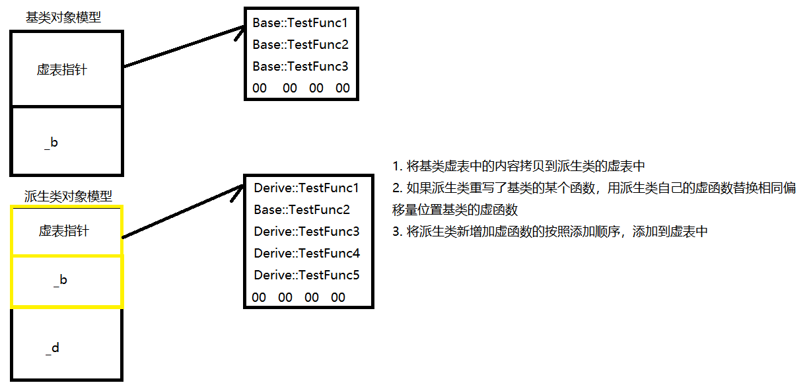

## 多态 

1. 概念
2. 举例子
3. 多态分类
    - 静态多态(函数重载，早绑定)
    - 动态多态(动态多态，晚绑定)
4. 动态多态的实现条件
    1. 基类中必须要有虚函数，派生类必须对基类的虚函数进行重写
    2. 必须通过基类的指针或者是引用来调用
    3. 两者缺一不可
    4. 体现：
        - 在程序运行时，基类的指针(引用)指向(引用)不同的子类对象，调用不同子类的虚函数。
    5. 条件没有满足：全部执行基类的行为
5. 对象类型
    - 静态类型：声明变量时的类型 --> 在程序编译时可以确定
    - 动态类型：在程序运行时实际指向的类型 --> 运行时才能确定
6. 重写(覆盖)
    - 基类中一定要有虚函数，才能进行重写
    - 子类如果重写的某个虚函数，必须与基类的虚函数原型保持一致(f返回值、函数名字、参数列表完全相同)
    - 例外：
        - 协变：返回值类型不同
            - 基类虚函数返回基类的指针/引用
            - 派生类虚函数返回派生类的指针/引用
        - 析构函数：函数名字不同
        - 访问权限可以不同
7. 关键字 (c++11)
    - override 修饰派生类的虚函数，检测其是否对基类的某个虚函数进行重写
    - final : 该虚函数不能被重写
8. 抽象类
    - 一个类中包含纯虚函数
    - 写法 : 虚函数 = 0;
    - 不能定义对象，
9. 如何实现多态
    - 基类
        - virtual void TestFunc1()
        - virtual void TestFunc2()
        - virtual void TestFunc3()
    - 派生类
        - virtual void TestFunc4()
        - virtual void TestFunc1()
        - virtual void TestFunc3()
        - virtual void TestFunc5()
    - 只要类中包含虚函数，编译器就会给该类维护一张虚表，将虚表地址放在对象的前4个字节
    - 派生类虚函数表生成规则
        1. 将基类虚表中的内容拷贝到派生类的虚表中
        2. 如果派生类重写了基类的某个函数，用派生类自己的虚函数替换相同偏移量位置基类的虚函数
        3. 将派生类新增加虚函数的按照添加顺序，添加到虚表中
        
        
10. 多继承
    |多继承对象模型|
    |:--:|
    |基类1|
    |基类2|
    |自己 |
    ||
    