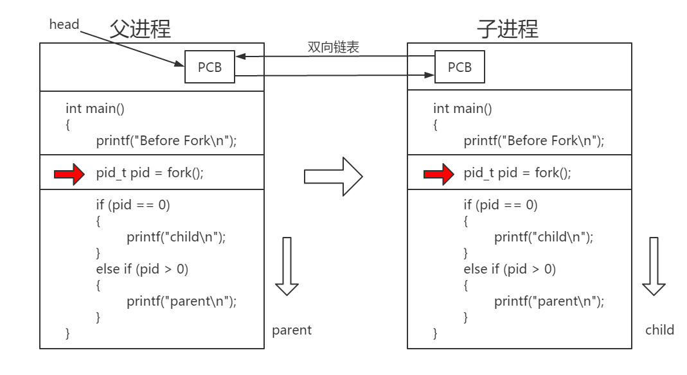

### 如何创建一个进程
#### 1. 程序
- 为了完成特定任务的一系列指令的有序集合​
- 存储在磁盘上
- 程序  : 代码 + 数据
#### 2. 进程
- 用户角度
	- 进行中的程序 -- 抽象的概念
- 操作系统角度	（是什么，为什么，实现方式）
	- 根据管理角度来看，进程就是操作系统对进程的描述信息  -- 实际上就是一个双向链表
		- 这个描述信息是操作系统对进程的一个具象化描述 -- 这个描述就是进程
		- 这个描述信息就是进程控制块PCB ： stack_struct结构体
		- Linux下的进程实际就是 task_struct 结构体 
	- 程序的一次动态执行过程
	- ​存储在内存中
	- 每个程序都有自己的状态
	- ​每个进程都有自己的虚拟地址空间
	- 进程 : 代码 + 数据 + 堆栈 + PCB
#### 3. 进程控制块 PCB 
- 为什么操作系统可以使用task_struct来运行程序呢？那么操作系统是如何描述的呢？
	- 标识符 ： 描述进程的唯一标识符，用来区别于其他进程
		- pid ： 进程唯一标识符
		- pwd ： 进程标识符
		- ppid ： 父进程进程号
	- 内存指针 ： 指向这个进程运行起来后程序以及数据被加载到内存的位置
	- 文件状态信息
	- 记账信息 : 包括处理器总和，使用时钟数总和，时间限制，记账号等
	- 进程状态 ： 任务状态，退出代码，退出信号
	- 上下文数据 ： 进程执行行时处理器的寄存器中的数据
	- 程序计数器 ： 程序中即将被执行行的下一一条指令的地址
	- 进程优先级 ： 相对于其他进程的优先级
#### 4. 进程状态的转换
- 基本程序的状态：运行，就绪，阻塞
- Linux的程序运行状态
	1. 运行态(R) : 运行，就绪
	2. 可中断睡眠状态(S) : 
	3. 不可中断睡眠状态(D) : 磁盘休眠
	4. 停止态(T)
	5. 死亡态(X)
	6. 追踪状态(t)
	7. 僵死状态(Z) : 处于僵死状态的进程


#### 5. 进程与内核的互交

#### 6. 创建一个进程的一般工作
1. 分配一个 PID  从小到大找一个未被使用的进程号 （0 - 32768  依机器而定  笔者为 ubuntu 18.04 64bit）
	- ```cat /proc/sys/kernel/pid_max```  具体查看方式
	- 0 号进程为内核进程，它创建 1 号进程、还将物理内存搬到磁盘  和 磁盘搬到物理内存
2. 分配PCB，拷贝父进程的 PCB的绝大部分数据
3. 给子进程分配资源
4. 复制父进程地址空间 (代码共享，数据独有)
5. 将子进程置成就绪状态，放入就绪队列
#### 7. 如何创建一个进程
1. **pid_t fork( void ) ;**
	- 通过复制一个进程创建一个新的进程
	- 创建一个新的进程并且复制父进程PCB中的数据
	- 对于父进程来说，fork 返回的是子进程的pid 
	- 对于子进程来说，fork 返回值是0
	
	例： 
```c
#include <stdio.h>
#include <unistd.h>
#include <stdlib.h>

int main()
{
	printf("Before Fork\n");
	pid_t pid = fork();
    
	if (pid == 0)
	{   
		printf("child\n");
	}   
	else if (pid > 0)
	{   
    	printf("parent\n");
	}
}
```

执行结果：

```Before Fork
Before Fork
parent
child 
```

​	为什么会打印两个 ？不应该打印一个parent 或者是 child 吗？



​	先是由父进程打印出 Before Fork ，运行到红色箭头处调用 fock 创建出一个子进程，该子进程也在红色箭头处运行，然后两个进程独立的运行，父进程的fork() 返回 >0 的数，打印出 parent ; 子进程 fork() 返回 0  ，打	印出 child ；打印的顺序与系统的进程调度有关。
-	**fork注意点：**
	1. fork 父子进程交替进行
	2. 父进程死亡，子进程将变成孤儿进程，由 1号 进程领养
	3. 子进程死亡，成为僵尸进程

**2. pid_t vfork( void )；**
- 用法和fork类似，但是有一点不一样，vfork要等子进程运行完后才继续执行父进程
- ​vfork的性能比fork要好，但是要想执行正确，必须在程序最后加上exit(0)或者调用exec；
#### 错误处理
- ​Linux 绝大部分函数出错返回值都是-1 ，那么如何知道到底时哪出错了呢；
- 为此 Linux 设计了一个全局变量errno；
```c​
#include \<errno.h>	//全局变量errno的头文件
​#include \<string.h>	//strerror函数头文件
​int errno ; 	//Linux 函数出错后，将错误编号但在errno 这个全局变量中
​if (fork() == -1){
	printf("%s",  strerror(errno));
	//strerror函数可以通过错误编码打印出相应的错误信息
}	​
```
- 注：只对于系统函数而言

**3. pid_t getpid()**
- 获取当前进程的pid

#### 进程优先级
- 进程优先级决定了进程获取CPU的资源优先权
- 优先级实际上就是一个数组，这个值越小，优先级就越高
- 为什么会有优先级：
	- 让操作系统运行的更加合理
- 如何设置优先级 : 无法直接设置
	- PRI(priority) : 优先级	值越大优先级越低
	- NI(nice) : 可以更改该值，到达设置优先级的目的
	- PRI = PRI + NI   NI -20 ~ 19
	- renice : 运行起来后修改
	- nice : 在程序运行前修改
- 进程的竞争性 : 因为操作系统上的进程都是一直在竞争资源
- 进程的独立性 : 为了使一个进程的操作不对另一个进程造成影响
- 进程的并行 : cpu资源足够的情况下，多个进程可以同时运行
- 进程的并发 : cpu资源不够的情况下，多个进程切换调度运行