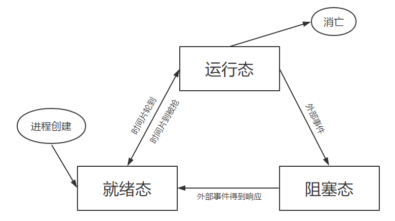
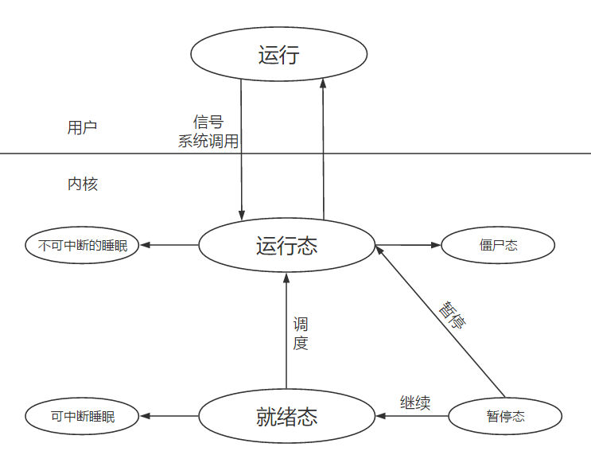

### 如何创建一个进程

#### 程序

​	为了完成特定任务的一系列指令的有序集合 

​	存储在磁盘上

​	程序  : 代码 + 数据

#### 进程

​	程序的一次动态执行过程

​	存储在内存中

​	每个程序都有自己的状态

​	每个进程都有自己的虚拟地址空间

​	进程 : 代码 + 数据 + 堆栈 + PCB

#### PCB （进程控制块）

​	pid  进程标识符

​	pwd 进程标识符

​	ppid 父进程进程号

#### 进程状态的转换



#### 进程与内核的互交



#### 创建一个进程的一般工作

​	1 、分配一个 PID  从小到大找一个未被使用的进程号 （0 - 32768  依机器而定  笔者为 ubuntu 18.04 64bit）

​		cat /proc/sys/kernel/pid_max  具体查看方式

​		0 号进程时内核进程，它创建 1 号进程、还将物理内存搬到磁盘  和  磁盘搬到物理内存

​	2 、分配PCB，拷贝父进程的 PCB的绝大部分数据

​	3 、给子进程分配资源

​	4 、 复制父进程地址空间 

​	5 、 将子进程置成就绪状态，放入就绪队列

#### 如何创建一个进程

​	**pid_t fork( void ) ;**   

​		当返回 0 时 代表的是子进程 ， 当返回 >0 时代表的是父进程

​	例： 

```c
#include <stdio.h>
#include <unistd.h>
#include <stdlib.h>

int main()
{
	printf("Before Fork\n");
	pid_t pid = fork();
    
	if (pid == 0)
	{   
		printf("child\n");
	}   
	else if (pid > 0)
	{   
    	printf("parent\n");
	}
}
```
执行结果：

```Before Fork
Before Fork
parent
child 
```

​	为什么会打印两个 ？不应该打印一个parent 或者是 child 吗？


​	先是由父进程打印出 Before Fork ，运行到红色箭头处调用 fock 创建出一个子进程，该子进程也在红色				箭头处运行，然后两个进程独立的运行，父进程的fork() 返回 >0 的数，打印出 parent ; 子进程 fork() 返回 0  ，打	印出 child ；打印的顺序与系统的进程调度有关。

​	**fork注意点：**

​		1 、 fork 父子进程交替进行

​		2 、父进程死亡，子进程将变成孤儿进程，由 1号 进程领养

​		3 、 子进程死亡，成为僵尸进程

​	**pid_t vfork( void )；**

​		用法和fork类似，但是有一点不一样，vfork要等子进程运行完后才继续执行父进程

​		vfork的性能比fork要好，但是要想执行正确，必须在程序最后加上exit(0)或者调用exec；

#### 错误处理

​	Linux 绝大部分函数出错返回值都是-1 ，那么如何知道到底时哪出错了呢；

​	为此 Linux 设计了一个全局变量errno；

​	#include \<errno.h>	//全局变量errno的头文件

​	#include \<string.h>	//strerror函数头文件

​	int errno ; 	//Linux 函数出错后，将错误编号但在errno 这个全局变量中

​	if ( fork( ) == -1)

​		printf("%s",  strerror(errno));	//strerror函数可以通过错误编码打印出相应的错误信息

​		注：只对于系统函数而言

