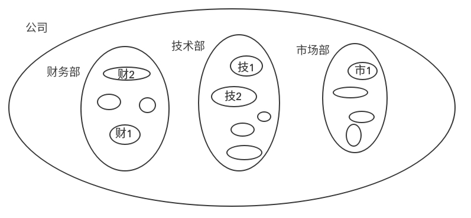

## 文件和文件夹的权限
我们在linux下有时候删除一个文件或者是文件夹时，会给你`Operation not permitted` 或者是`Permission denied`，这是为什么呢？看完这篇博文，你就会清楚了。/手动滑稽
#### 1. 文件的权限
> 我们在终端中输入ls -l 命令，会列出当前工作目录下的文件，不知道大家有木有注意到，最前面有一堆字母，这个是什么意思呢？我们往下看

- 一共有10位，这10位都代表这什么呢？
    |  -  | - - - | - - - | - - - |
    |:---:|:---:|:---:|:---:|
    | 文件类型 | 所有者权限 | 所属组权限 | 其他人权限 |
    |  d  | r x - | r w - | r - - |
    | 二进制表示 | 1 1 0 | 1 1 0 | 1 0 0 |
    | 数字表示 |   6   |   6   |   4   |
    | | | | |

   其中，第一位是文件的类型，后面九位就是权限，分为三组，每组都是由r w x - 这四个字符中的三个组成， 分别代表读，写，执行，- 是标示没有该权限。太过概念化？ 我们可以画一个图来看一看；
    
    在图中，整个公司就相当于我们的操作系统，那么每个部门呢？那就对应着组。那么其他呢？那就是除该组以外的成员都是其他人。
    
    举个栗子：假设有一个文件属于财2，权限就是上面的权限，那么财2对文件有读写的权限；财1 对于 财2 来说就是同组的成员，那么财1对于该文件只有读和执行的权限；技1 对于 财2 来说是其他人，那木技1只有读的权限。就是这么简单。

- 具体代表的内容和所能执行的操作
    - r : 读取 --> 查看
    - w : 写入 --> 修改
    - x : 执行 --> 运行该程序/脚本
- 创建文件的默认权限
  - 创建一个文件的默认权限是0777
  - 当我们用touch创建一个文件时，他的权限却不是这个为什么呢？
  - 我们系统内有一个变量叫做umask，当我们创建一个文件时是按照 默认权限 - umask 来设置的，你们一算可能不对，就大喊博主骗子，其实创建文件时，默认去掉了所有的执行权限，然后就得到了现在你看到的权限。
- 那么问题又来了，当我们创建一个脚本文件时，我们需要执行权限，但是touch出的文件没有执行权限怎么办？
  - 其实解决方法很简单 --> 就是直接修改该文件所对应的权限
  - chmod (能够使用的成员：文件所有者或者管理员)
    - 用法：
      1. 使用u(所属者) g(所属组) o(其他人) a(全部) +/-/= 想要写改的对应权限 
         - 例如：`chmod u+x shell.sh //给所属者加上执行权限`
      2. 直接一次性设置所有的权限
         - 例如：`chmod 775 shell.sh //一次设置全部权限`
    - 一些其他关于权限的命令(多数只能由管理员使用)
      - chown : 改变文件的属主
      - chgrp : 改变文件的所属组
1. 文件夹的权限
> 不知大家注意到没，普通文件的开头都是 - ，那么文件夹呢？文件夹的开头都是 d 代表这是一个文件夹。
- 那么文件夹的权限看起来和文件一样，但是他们真的一样吗？
  - 文件夹创建时的默认权限：0777
  - 文件夹权限所代表的含有
    - r : 
    - w : 
    - x : 