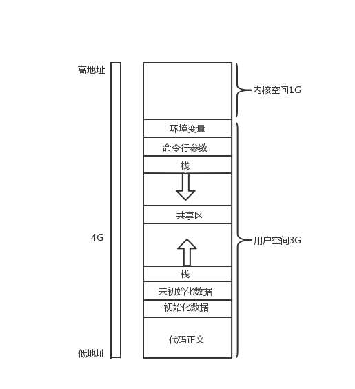
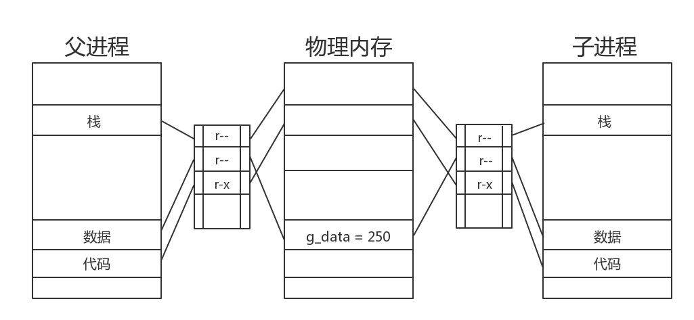

## 虚拟地址空间

- 虚拟地址空间实际上是一个结构体  struct mm_struct
- 是一个进程对进程的描述
- 虚拟地址空间是一个假的内存地址，是用来欺骗进程的。
    - 因为进程要求地址连续，然而如果直接使用物理内存则内存使用率太低，以及缺乏内存访问控制。因此使用分页式内存管理，虚拟一套连续的内存，进过页表来讲使用的地址映射到物理内存，这样的话物理内存就不必要连续的内存，内存的访问控制也可以通过页表中记录的地址属性进行控制。
    
#### 虚拟地址空间图



打印全局变量

```c
#include <stdio.h>
#include <stdlib.h>
#include <unistd.h> 
int g_data = 250;

int main(void)
{	
	
	pid_t pid = fork();   
    if (pid == 0){
        printf("child g_data = %p\n", &g_data);
        printf("child g_data_value = %d\n", g_data);
        g_data = 520;
        printf("child g_data_value = %d\n", g_data);
    }else{
        sleep(1);
        printf("parent g_data = %p\n", &g_data);
        printf("parent g_data_value = %d\n", g_data);
    }
    exit(0);
}
```

打印结果

```
child g_data = 0x55aa80ce4010
child g_data_value = 250
parent g_data_value = 520
parent g_data = 0x55aa80ce4010
parent g_data_value = 250

```

为什么在子进程中更改了g_data的值父进程没有改变呢？

​	1、当父进程刚刚执行完fork后，操作系统会把父进程的栈和数据区的权限都改成只读权限，然后复制到子进程。	

​	2、当子进程更改g_data的值时，子进程发现当前g_data的权限为只读，操作系统就为子进程会开辟出一块自己的空间存放g_data，并将两个页表的相应的权限改为 rw-  ，然后让页表中相应项只指向新开辟的这个空间。

​	这样，在父进程中打印的是父进程中g_data指向的物理内存的值，在子进程中打印的是子进程中g_data指向的物理内存的值。

​	3、哪为什么父进程和子进程打印的地址会一样呢？

​	因为，我们程序猿看到的地址其实都是虚地址，而且子进程中的内容都是从父进程那里拷贝过来的，所以呢他们打印出来的地址当然时一样的了。

​	如果实在不懂，请参考我博客的另一篇文章：

​	<a href=https://www.cnblogs.com/YeLing0119/p/9754090.html>如何创建一个进程<a>

