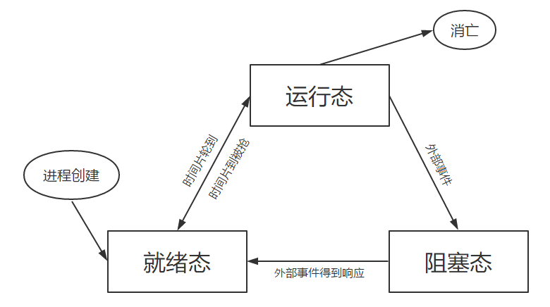
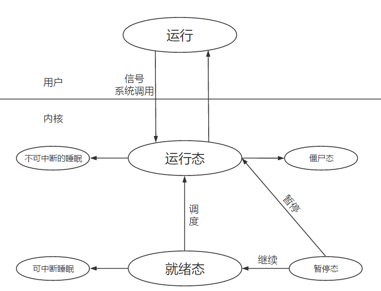

#### 程序

​	为了完成特定任务的一系列指令的有序集合 

​	存储在磁盘上

​	程序  : 代码 + 数据

#### 进程

​	程序的一次动态执行过程

​	存储在内存中

​	每个程序都有自己的状态

​	每个进程都有自己的虚拟地址空间

​	进程 : 代码 + 数据 + 堆栈 + PCB

#### PCB （进程控制块）

​	pid  进程标识符

​	pwd 进程标识符

​	ppid 父进程进程号

#### 进程状态的转换

#### 进程与内核的互交

#### 创建一个进程的一般工作

​	1 、分配一个 PID  从小到大找一个未被使用的进程号 （0 - 32768  依机器而定  笔者为 ubuntu 18.04 64bit）

​		cat /proc/sys/kernel/pid_max  具体查看方式

​		0 号进程时内核进程，它创建 1 号进程、还将物理内存搬到磁盘  和  磁盘搬到物理内存

​	2 、分配PCB，拷贝父进程的 PCB的绝大部分数据

​	3 、给子进程分配资源

​	4 、 复制父进程地址空间 