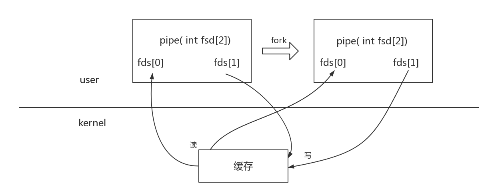
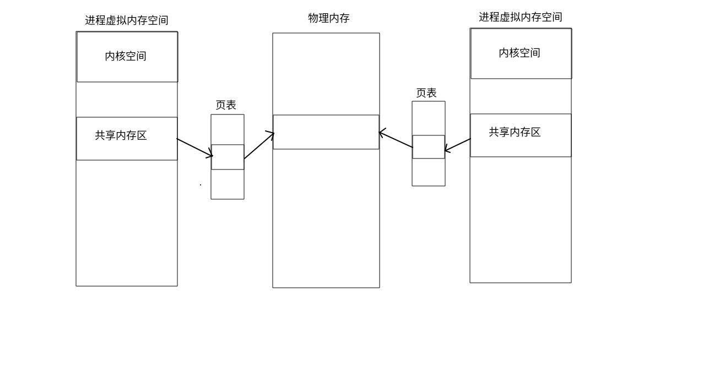

## 进程间通信（IPC）

#### 为什么要进程通信？
> 为什么要进程间通信：大项目的模块化，协同运行
1. 数据传输
    > 一个进程需要将它的数据发送到另一个进程
2. 资源共享
    > 多个进程之间共享同样的资源
3. 通知事件
    > 一个进程要向另一个程序发送通知消息，通知它们发生了某种事件，比如子进程终止时要通知父进程
4. 进程控制
    > 有些进程希望完全控制另一个进程的执行（比如 ： DEGUG），此时控制进程希望能够拦截另一个进程的所有陷入和异常，并能够知道他们状态的改变。
> 为什么进程通信需要操作系统提供接口：因为独立性
- 操作系统如何能够让进程之进行通信：给多个进程之间提供一个公共的，都能访问到的媒介
- 操作系统因为提供进程间通信的使用场景不同，因此提供的进程间通信方式也有多种，各自也有各自的特点，本质上都是提供多个进程都能访问的缓冲区
#### 进程间通讯的发展
1. 管道
    - 匿名
    - 命名
2. SystemV 标准 (系统调用使用)
    - ​消息队列（数据传输）
    - ​共享内存（资源共享）
    - 信号量（事件通知）
3. POSIX 标准 (标准c库使用)
    - 消息队列
    - 共享内存
    - 互斥量
    - 条件变量
    - 信号量
    - 读写锁
#### 管道
- 用于在进程间传输数据资源
- 对于管道这块缓冲区的操作，和io操作使用同一套接口
- 管道的特性
    - 管道时半双工通讯(单向通讯)
    - 读写特性
        - 如果管道中没有数据，则read会阻塞，直到读取出数据
        - 如果管道中数据满了，则write会阻塞，直到有数据被读出去
        - 如果管道的所有写端都被关闭，那么读端读完管道中的数据之后，返回0
        - 如果管道的所有读端都被关闭，那么写端写入数据的时候会触发异常，退出进程
    - 管道自带同步与互斥保护操作
        - 当对管道的读写数据大小不大于PIPE_BUF时候，将保证数据读写的原子性
        - 同步：对临界资源操作的时序可控性
        - 互斥：对临界资源在同一时间的唯一访问性
    - 提供字节流服务(数据传输灵活，但是有可能造成数据的粘连)
    - 生命周期随进程
    - 匿名管道:只能用于具有亲缘关系的进程
- 匿名管道  
    - 创建的缓冲区没有标识，因此**只能用于具有亲缘关系的进程间通信**，创建一个管道，返回两个文件描述符，这时创建一个子进程，子进程复制父进程，因此子进程也有相同的描述符指向内核相同的缓冲区，这是就可以通信了
        > ```int  pipe (int fds[2])；```

    
    - 一个例子
        > [利用管道函数pipe实现进程间通讯](https://github.com/YeLing0119/MyCode/tree/master/Linux/pipe)
- 命名管道
    > 可见于文件系统，所以所有的进程可以通过打开文件，获取到内核管道这块缓冲区对应的描述符．因此命名管道可以用于同一机器上的任一进程间通讯
    - 创建命名管道文件
        > `mkfifo test.fifo`
    - int mkfifo(const char *parhname, mode_t mode)
        - 功能：创建一个管道文件
        - 参数：
            - pathname : 路径
            - mode : 权限
        - 返回值：成功０　失败　-1
    - 命名管道的特性
        - 命名管道与匿名管道各种特性都一样(除了亲缘间进程通信)
        - 命名管道的打开特性
            - 如果管道文件只读打开，将阻塞，直到有这个文件被以写的方式打开
            - 如果管道文件只写打开，将阻塞，直到有这个文件被以读的方式打开
            - 如果管道文件以读写打开，则就不阻塞
#### 消息队列
> 操作系统在内核创建一个结构，结构中包含一个队列，进程同步就是往队列中添加节点，以及获取节点实现进程间通讯，因为节点是有类型的，所以他是一个优先级队列。

传输的是有类型的数据块，类型(整数)可以用于定义优先级，用于区分进程，用于区分数据功能

限制：最大的占用字节数大小限制
1. 获取/创建消息队列
    ```c
    ​#include \<sys/msg.h\>	
    #include \<sys/ipc.h>
    int msgget(
        key_t key ,  // 相当于文件名
        int flags	// 创建  IPC_CREAT | 0644(权限)                // 打开  0
    );
    ```
    - 返回值：消息队列的id ，相当于文件描述符
    - 查看IPC对象 
    - ipcs  -q  //查看消息队列   查看IPC对象
    - ipcrm  -Q  key  //删除指定key的消息队列 删除IPC对象
    - 系统中最多可以创建多少个消息队列?​
        - cat /proc/sys/kernel/msgmni	//最多创建个数
        - cat /proc/sys/kernel/msgmax	//一条消息最多装多少字节
	    - cat /proc/sys/kernel/msgmnb	//一个消息队列中一个消息的总字节数是多少
2. 发送消息
    ```c
    int msgsnd(int msgid, //msgget的返回值
        const void* msgp, //消息的位置必须是类似于
                          //msgbuf的结构体
        size_t len , //消息的长度不包括type的大小
        int flag    //消息的标志位
    );
    ```
    返回值	： -1 //失败		0 //成功
    ```c
    struct msgbuff{
        long type ; //消息类型	必须 >= 1	必须有
        char mtext[1]	//随意类型，写上自己的消息
    }	
    ```
3. 接收消息
    ```c
    ssize_t msgrcv(
        int msgid, //msgget的返回值
        void *msgp, //取出消息存放位置
        size_t msgsz, //装消息位置的大小，不包括类型
        long msgtype, //取那个类型的消息
        int msgflag //选项，一般填0，表示没有消息就在等，有了就取出来
    );
    ```
- 返回值：-1	失败   	成功实际拷贝的字节数
#### 共享内存
> 开辟一块空间，将内存映射到进程的虚拟地址空间，然后可以直接堆内存进行操作，而其他的进程间通讯方式需要对数据在用户空间和内核空间之间拷贝
- 特点
    - 进程间通讯最快的方式



1. 创建或者打开共享内存
    ```c
    ​shmget(
        key_t key, //共享内存的标识符(可以使用ftok创建)
        size_t size, //共享内存的大小
        int flag 　//创建IPC_CREAT|0664	打开0
    );
    ```
    - 若描述符key存在，则后两个参数无效
    - 返回值：失败　-1  成功　返回操作句柄　

2. 让共享内存与本进程建立关系(将共享内存映射到进程中)
    ```c
    ​void  *shmat(
        key_t key, 
        const char* shmaddr, //让操作系统挂载到地址空间的               位置 若为NULL，这让操作系统自己选择 
        int flag  // 0
    );
    ```
    - 返回值：成功返回　实际挂载到虚拟地址空间的起始位置　失败返回　(void *) -1;
3. 卸载掉共享内存(解除映射关系)
    `int shmdt(void * shmaddr);`
4. 删除共享内存
    ```c
    ​int shmctl(
        key_t key, 
        int cmd, //IPC_RMID 删除共享内存
        NULL //本来这里是个结构体，但是删除用不上，直接填NULL
    )
    ```
    删除共享内存，并不会直接删除，先是等待 nattch 变成 0，并在等待期间，拒绝新的映射链接

#### 信号量
- 是什么？
    > 其实就是一个计数器 + 等待队列　--> 用于对资源进行计数
    - 获取一个资源，计数 - 1，如果没有资源，计数为零，为了获取资源因此死等
    - 回收一个资源，计数 + 1，唤醒死等，唤醒的是信号量等待队列上的进程
- 功能就是等待与唤醒：用于实现进程间的同步与互斥
    - 同步：对资源操作时，如果计数为０，标示没有资源，代表不能操作则死等，资源回收后计数 + 1，被唤醒才能进行操作
    - 互斥：计数只有０和１，要不然有资源操作，要不然没有资源操作
        - 别人拿走资源，计数变成０，不能操作则死等，意味着别人对资源操作期间谁都无法堆资源进行操作
#### 信号
> 就是一个软件中断，通知进程发生某件事情，打断进程当前操作，去处理这个事件
- 功能：通知进程事件的发生
- 信号不是立即处理的，而是选择一个合适的时机处理
- 信号有默认的处理方式，当然也可以改变。信号是可以被阻塞，暂时不处理，而不是忽略。
- 信号的生命周期：信号的产生 --> 信号在进程的注册 ( --> 阻塞一个信号) --> 信号的注销 --> 处理信号 

- 信号的产生
    1. 程序异常
    2. 硬件中断
    3. 软件条件(程序中产生信号)
        - 一共有62个信号 (1-31) (34-64)　`kill -l`
        - (1 - 31) : 特定事件 非可靠信号 有两个用户可使用信号 SIGUSR1 SIGUSR2
        - (34 - 64) : 用户使用 可靠信号
- 用户如何在程序中产生一个信号
    - int kill(pid_t pid , int sig)
        - 功能：给指定进程发送一个信号
        - 参数：
            - pid : 进程的编号
            - sig : 信号的值　(信号其实就是一个数字)
    - int raise(int sig)
        - 功能 ： 给自己发送一个信号
    - int abort(void)
        - 给自己发送SIGABRT信号
    - int alarm(unsigned int second)
        - 在second秒之后发送一个SIGALRM信号(设置一个定时器)，
        - 返回值：上一个定时器剩余时间
    - int sigqueue()
        - 功能：向指定进程发送信号，并携带一个结合体参数
        - 结合体形式：
            ```c
            union sigval {
                int   sival_int;
                void *sival_ptr;
            };
            ```
    - core dump : 核心转储
        - 程序异常退出时，保存进程的运行数据及调用栈信息，便于  事后调试；
        - 默认时关闭的：主要是占用资源，保证数据安全。
        - 开启core　dump  `ulimit -c unlimited`
- 信号的注册与注销
    > 将信号记录在(pcb)中，　如下
    ```c
    task_struct{
        struct sigpending{
            sigset_t pending;  // 位图
            struct sigqueue* ; // 信号队列
        }
    }
    ```
    - 注册流程
        - 向pcb中添加相应信号的sigqueue节点，并修pending位图，标记这个信号需要被处理
        - _sigset_t 位图结构体　里面一共有1024位
    - 信号的注销:删除节点，修改位图
    - 非可靠信号：若位图为０，则添加节点，修改位图，若位图为１，则什么都不做(第二次到来的信号被丢弃)
    - 可靠信号：不管位图是否为１，信号每次注册时都要添加新节点，删除一个节点，如仍有相同的信号节点，则不修改位图，否则修改位图为０
- 信号的处理
    - 默认处理方式：系统中已经定义好了，处理这个信号多对应的时间
    - 忽略处理：信号到来，不注册
    - 自定义处理方式：自己定义信号的回调函数
        - signal
            - 函数原型
                ```c
                typedef void (*sighandler_t)(int);
                sighandler_t signal(int signum, sighandler_t handler);
                ```
            - 修改信号处理函数
            - 参数：
                - signum：信号的编号
                - ighandler_t handler 函数指针
                    - SIG_IGN 忽略处理
                    - SIG_DFL 默认处理
                    - 给出相应的处理函数
        - sigaction
            - 函数原型
            ```c
            int sigaction(
                int signum, //信号值
                const struct sigaction *act,　//信号新行为
                struct sigaction *oldact　//保存原有行为
            );

            struct sigaction {
               void (*sa_handler)(int);
               void (*sa_sigaction)(int, siginfo_t *, void *);
               sigset_t sa_mask; //位图　标记临时阻塞信号
               int sa_flags;    //制定调用的函数１/2
               void (*sa_restorer)(void);
            };
            ```
            - 功能：为信号重新定义新的行为，并保存旧的行为到oldact
            - 参数：
- 信号的捕捉流程
    > 主要针对于自定义信号处理方式
    
    - 信号并不是注册后立即被处理，而是选择一个合适的时机
    - 那种方式可以实现用户态到内核态的切换？
        - 异常
        - 中断
        - 系统调用接口